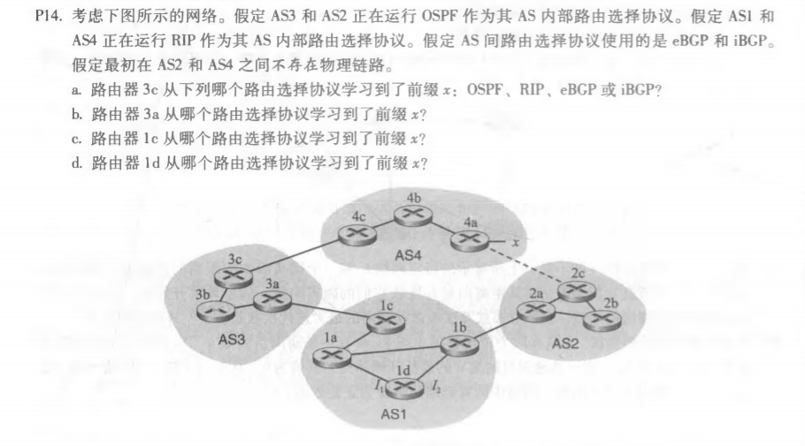
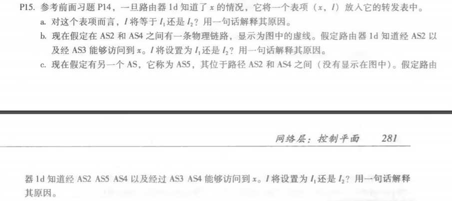
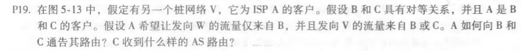
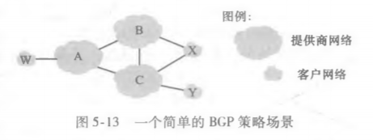

#### P14.

题目：

答：

a. eBGP

b. iBGP

c. eBGP

d. iBGP

#### P15.

题目：

答：

a. **I1 ,**因为选择 **I1** 到 1c 的距离最近

b. **I2 ,** 因为两条路径通过的AS-PATH 的长度相等，但是 **I2** 到 NEXT-HOP 路由器最近

c. **I1** , 因为选择**I1** 通过的AS-PATH的长度更短

#### P19.

题目：

答：

A向B通报A-W和A-V两条路径，A向C只通报A-V一条路径

C收到的AS路由是 B-A-W、B-A-V和A-V

