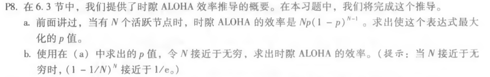

#### P5.

题目：

答：r = 4,  D = 1010101010, G = 10011

​		R = remainder[(D*2r) / G] = 0100

#### P8.

题目：

答：

a.	f(p) =  Np(1 - p)N-1 

​		f'(p) = N[(1 - p)N - 1 - p(N - 1)(1 - p)N - 2] = N(1 - p)N -2(1 - pN)

​		故易得当 p = 1/N 时，时隙ALOHA的效率的表达式为最大值

b.	f(1/N) = N * (1/N) * (1 - 1/N)N - 1  =  (1 - 1/N)N - 1

​		当 N 接近于无穷时，(1 - 1/N)N - 1 接近于 1/e

​		故N接近无穷时，时隙ALOHA的效率为 1/e

​		