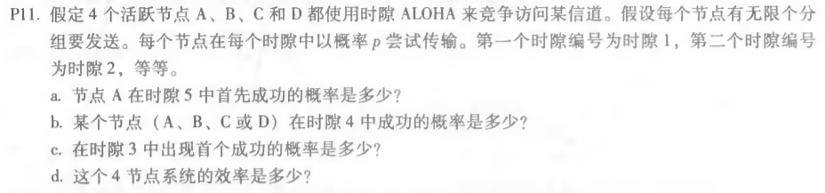

#### P10.

答：

题目：

a. 节点A的平均吞吐量为 **pA(1 - pB)**

​	总体效率为 **pA(1 - pB) + pB(1 - pA)**

b. 代入公式中可得： 节点A平均吞吐量为 **pA(1 - pB) = 2 pB(1 - pB)**，节点B平均吞吐量为 

​	**pB(1 - pA) = pB(1 - 2pB)**，易得节点A的平均吞吐量不比节点B大两倍。

​	如果要使其成立，则 **pA(1 - pB) = 2pB (1 - pA )**，得到方程 **pA + pA pB - 2pB = 0**，则pA 、pB 满足

​	方程即可

c. 节点A的平均吞吐量为 **2p(1 - p)N - 1**

​	其他节点的平均吞吐量为 **p(1 - p)N - 2 (1 - 2p)**

#### P11.

题目：

答：

a. 节点A在前五个时隙中每个成功的概率为 **p(1 - p)3** 

​	则节点A在前四个时隙均失败概率为 **（1 - p(1 - p)3 )4** 

​	则节点A在第五个节点首次成功的概率为 **（1 - p(1 - p)3 )4 p(1 - p)3**

b. **4p(1 - p)3**

c. 由b中答案可得在前2个时隙中所有节点均失败的概率为**（1 - 4p(1 - p)3 )2**

​	则在时隙3中出现首个成功的概率为 **（1 - 4p(1 - p)3 )2 4p(1 - p)3**

d. 效率为 **4p(1 - p)3**

#### P13.

题目：

答：一个周期的时间为： **N(Q/R + dpoll)**

​		一个周期内的传输量：**NQ**

​		则最大吞吐量为：**NQ / ( N(Q/R + dpoll) ) = Q / (Q/R + dpoll)**