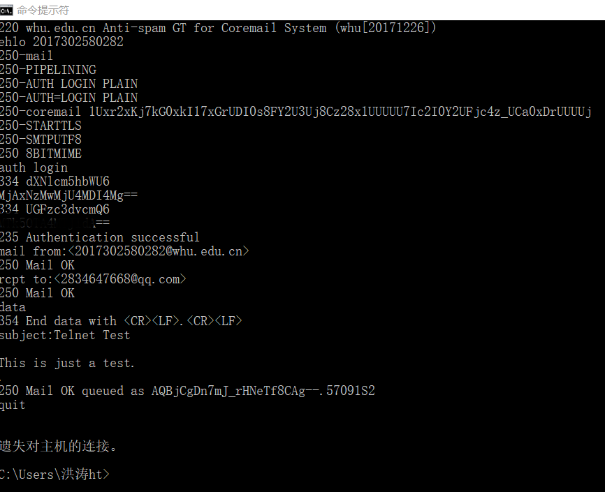
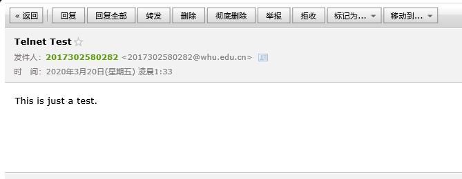
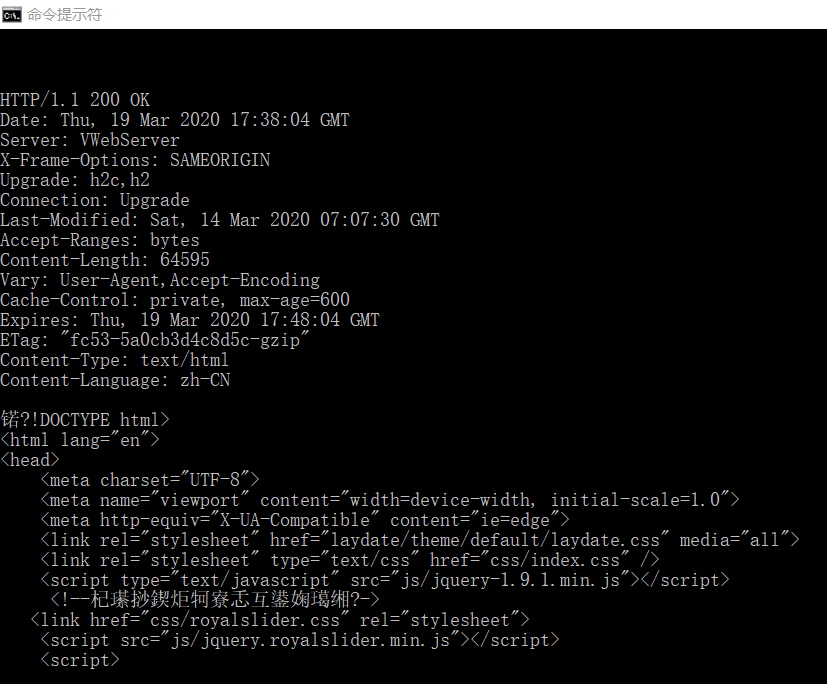
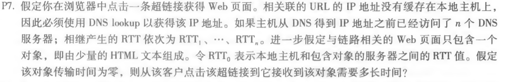
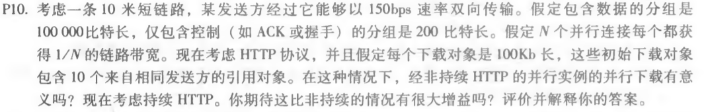

#### telnet whu.edu.cn 25

在DOS命令窗口输入 **telnet whu.edu.cn 25** 连接，再进行如下图的互动。

接收到的邮件：

### telnet maths.whu.edu.cn 80

在DOS命令窗口输入 **telnet whu.edu.cn 25** 连接，再输入命令（命令行中不显示输入命令）

**GET /index.htm HTTP/1.1 \r\n**
**Host: maths.whu.edu.cn \r\n \r\n**

获取页面信息

#### P7.

题目：

答：

得到 IP 地址的时间： RTT1 + RTT2 + … + RTTn
得到 IP 后，获取网页需要的时间： 2RTT0
则接收到该对象的时间： 2RTT0 + RTT1 + RTT2 + … + RTTn

#### P10.

题目：

答：

10米短链较路，可以忽略其传播时延。

非持续HTTP的并行下载总时延：
(200b / 150bps) * 3 + ((10^5)b/ 150bps) + (200b / (150bps / 10)) * 3 + ((10^5)b / (150bps / 10)) = 7377.3s

持续HTTP的时延：
(200b / 150bps) * 3 + ((10^5)b / 150bps) + 10 * (200b/150bps + (10^5)b/150bps) = 7351s

由计算结果可以看出，持续HTTP相较于非持续HTTP时延较小。但在该题条件下，时延相差较少，增益并不大。