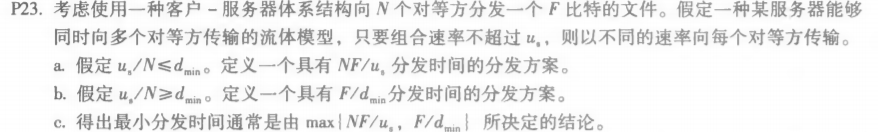

### nslookup

### P8.

题目：

答：由P7可得，接收到该网页对象的时间为  2RTT0 + RTT1 + RTT2 + … + RTTn ，则：

​		a. 没有并行 TCP 连接的非持续 HTTP：

​			**2RTT0 + RTT1 + RTT2 + … + RTTn + 8 * 2RTT0 = 18RTT0 + RTT1 + RTT2 + … + RTTn** 

​		b. 配置有5个并行连接的非持续HTTP：

​			**2RTT0 + RTT1 + RTT2 + … + RTTn + 2 * 2RTT0 =  6RTT0 + RTT1 + RTT2 + … + RTTn** 

​		c.  持续HTTP：

​			**18RTT0 + RTT1 + RTT2 + … + RTTn  + RTT0 = 3RTT0 + RTT1 + RTT2 + … + RTTn** 

### P23. 

题目：

答：

a. 服务器向每个客户端并行发送文件

​	此时速率应该为 us / N ，因为 us / N <= dmin ，所以客户端将以 us / N 速率下载，则分发时间为：

​	F / (us / N) = NF / us 

b. 服务器向每个客户端并行发送文件

​	此时速率应该为 us / N ，因为 us / N >= dmin ，所以客户端将以 dmin 速率下载，则分发时间为：F / dmin

c. 综合a，b两题进行分析：

​	当 us/N <=dmin 时：

​		N/us >= 1/dmin

​		NF/us>= F/dmin

​		由a题可知此时 t = NF/us = max{NF/us, F/dmin}

​	当 us/N >=dmin 时：

​		N/us <= 1/dmin

​		NF/us <= F/dmin

​		由b题可知 t = F/dmin = max{NF/us, F/dmin}

​	因此：得出最小分发时间为 max{NF/us，F/dmin}

### P24.

题目：

答：

a.  us 成为瓶颈，故此时每一个用户以小于 ui 的速率上载，服务器全速上载。

​	此时由于服务器速率的限制，故分发时间为 F / us

b. 用户的总上传速率成为瓶颈，故用户全速上载。

​	服务器和其他用户同时作为端进行上载，故分发时间为 NF / (us + u1 + ... + uN)

c. 由a,b两题易得：

​	当 us <= (us + u1 + ... + uN) / N 时，F / us >= NF / (us + u1 + ... + uN) 

​	又由a可知此时最小分发时间为 t = F / us = max{F / us ， NF / (us + u1 + ... + uN) }

​	当 us >= (us + u1 + ... + uN) / N 时，F / us <= NF / (us + u1 + ... + uN) 

​	又由a可知此时最小分发时间为 t =  NF / (us + u1 + ... + uN) = max{F / us ， NF / (us + u1 + ... + uN) }

​	故可得最小分发时间由 max{F / us ， NF / (us + u1 + ... + uN) } 决定