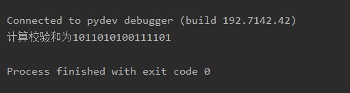
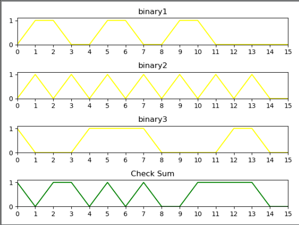
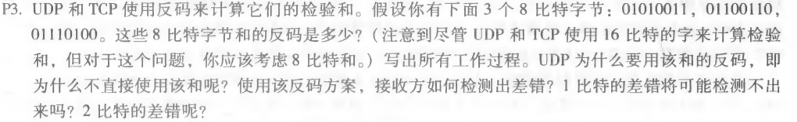
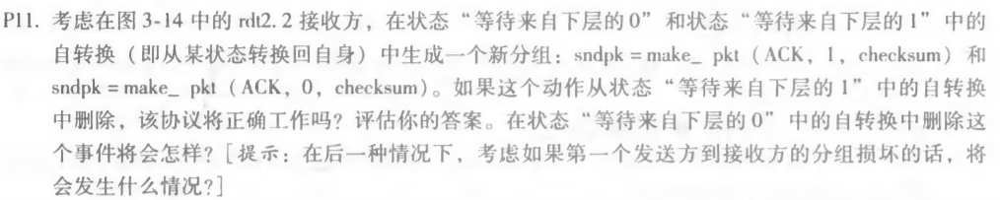
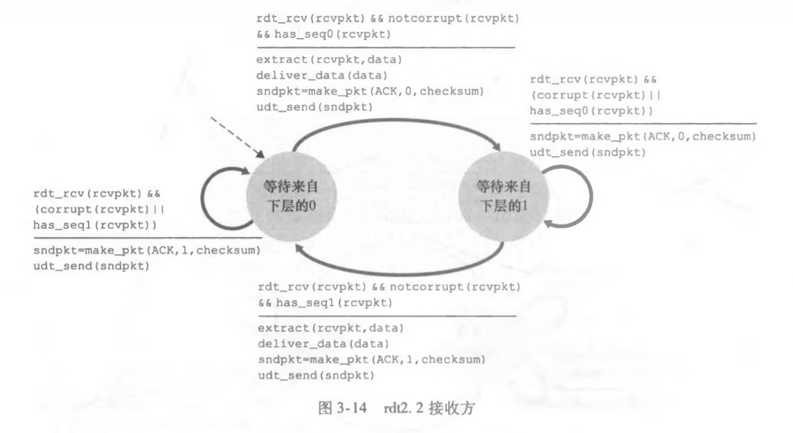

#### python实现UDP的16位校验和

代码见 [UdpCheck.py](UdpCheck.py)文件

计算的校验和输出图：

图像输出图：

#### P3.

题目：

答：

3个字节的和为：**01010011 + 01100110 + 0111010 = 1 0010 1101**

回卷相加可得和为 **0010 1110**

则其反码为 **1101 0001**

使用反码有以下好处：

​	1.不依赖系统是大端还是小端

​	2.计算检验和比较简单快速

接收方检验差错的方法是将三个字节与检验和相加，如果任何一个位为 0，说明出错。

1比特的差错肯定会导致结果不同，2比特的差错如果出现在同一位则有可能检测不出。

#### P11.

题目：

答：如果从“等待来自下层的1”中删除，不会影响正常工作，因为 sndpkt 已经被生成了。

​		如果从“等待来自下层的0”中删除，而且接收方刚刚启动（处于初始状态），sndpkt 是一个错

误的值，那么发送方会认为 ACK 损坏并重发分组，接收方会继续发送错误值，这将会导致一个死锁。