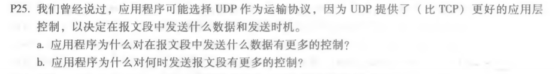
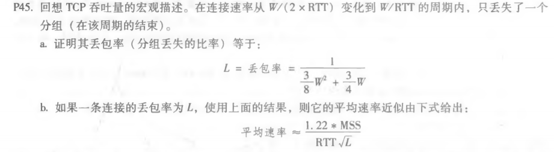
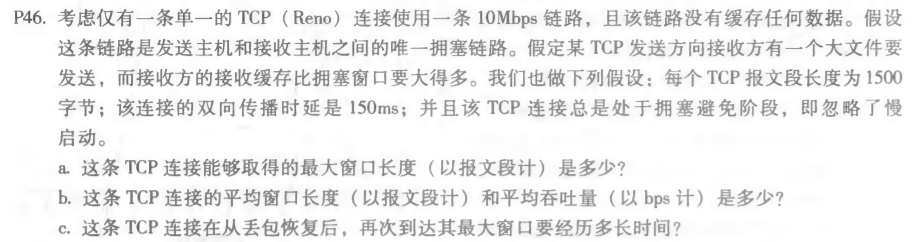

#### P25.

题目：

a） 使用TCP，应用数据将数据写入连接发送缓冲区，TCP将获取字节，而不必在TCP段中放入一条信

息。而使用则UDP直接将数据打包。因此，使用UDP，应用程序可以更好地控制在报文段中发送什么

数据。

b） 对于TCP，由于流控制和拥塞控制，从应用数据向发送缓冲区写入数据到将数据发送到网络层，可

能存在很大延迟。而对于UDP，没有流量控制和拥塞控制，不存在延迟。

#### P45.

题目：

a） 总共传输的包的数量为：

​		1/2 * (W - W/2 +1) * (W/2 + W) = 3/8 * W2 + 3/4 * W

​		丢失一个包，则 L = 1 / (3/8 * W2 + 3/4 * W)

b） W足够大时，3/8W2  >>  3/4W，此时 L $\approx$ 1 / (3/8 * W2)，则 W $\approx$ ( 8 / (3L) )1/2

​		平均吞吐率 = 0.75W / RTT $\approx$ 1.22 * MSS / ( RTT * L1/2 )

#### P46.

题目：

a） 最大窗口长度W受限于链路速率：W * MSS / RTT = 10Mbps

​		得 W = 125，故最大窗口长度为 125

b） 从 W / 2 到 W：平均窗口长度为 (W / 2 + W) / 2 = 0.75W = 94

​		故平均吞吐量为 94 * 1500 * 8 / 0.15 = 7.52Mbps

c） 最小窗口为：W / 2 + 3 = 65

​		则需要经历的时间：（125 - 65）* 150ms = 9s

