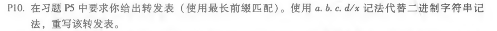
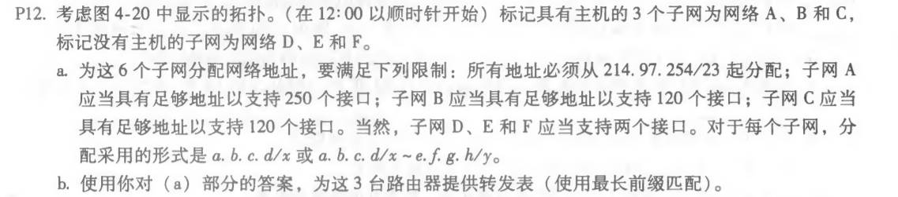
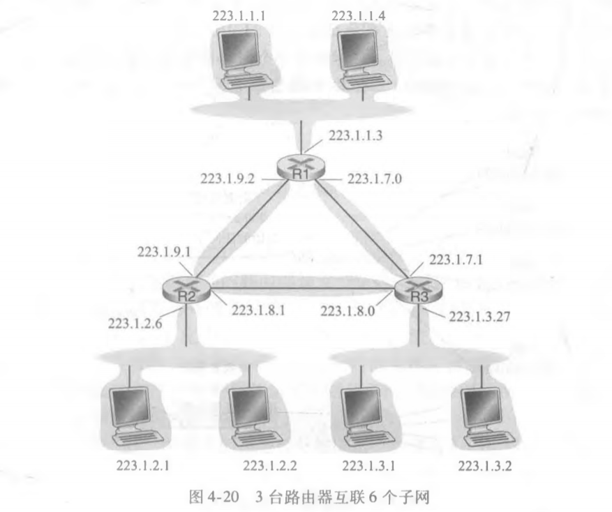
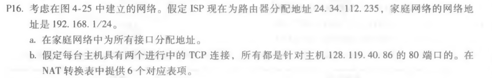
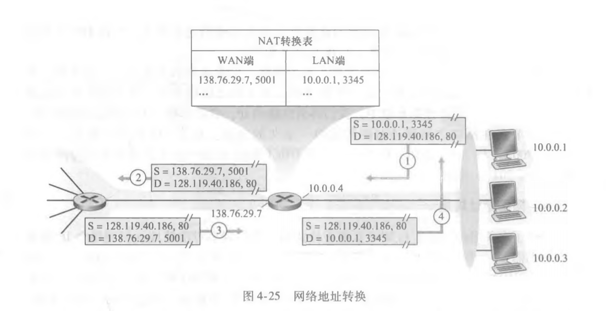

#### P10.

题目：

答：

| 目的地址  | 接口 |
| :-------: | :--: |
| 224.0/10  |  0   |
| 224.64/16 |  1   |
|   224/8   |  2   |
| 225.128/9 |  3   |
|   其他    |  3   |

#### P12.

题目：

答：(a)

| 子网 |             地址域              |
| :--: | :-----------------------------: |
|  A   |          214.97.255/24          |
|  B   | 214.97.254.0/25~214.97.254.0/29 |
|  C   |        214.97.254.128/25        |
|  D   |         214.97.254.0/31         |
|  E   |         214.97.254.2/31         |
|  F   |         214.97.254.4/30         |

(b)

1

|                前缀                | 接口 |
| :--------------------------------: | :--: |
|     11010110 01100001 11111111     |  A   |
| 11010110 01100001 11111110 0000000 |  D   |
| 11010110 01100001 11111110 000001  |  F   |

2

|                前缀                | 接口 |
| :--------------------------------: | :--: |
| 11010110 01100001 11111111 0000000 |  D   |
|    11010110 01100001 11111110 0    |  B   |
| 11010110 01100001 11111110 0000001 |  E   |

3

|                前缀                | 接口 |
| :--------------------------------: | :--: |
| 11010110 01100001 11111111 000001  |  F   |
| 11010110 01100001 11111110 0000001 |  E   |
|    11010110 01100001 11111110 1    |  C   |

#### P16.

题目：

答：

(a) 192.168.1.1;	192.168.1.2;	198.168.1.3;	192.168.1.4

(b)

|         WAN         |        LAN        |
| :-----------------: | :---------------: |
| 24.34.112.235, 4000 | 192.168.1.1, 3345 |
| 24.34.112.235, 4001 | 192.168.1.1, 3346 |
| 24.34.112.235, 4002 | 192.168.1.2, 3445 |
| 24.34.112.235, 4003 | 192.168.1.2, 3446 |
| 24.34.112.235, 4004 | 192.168.1.3, 3545 |
| 24.34.112.235, 4005 | 192.168.1.3, 3546 |
