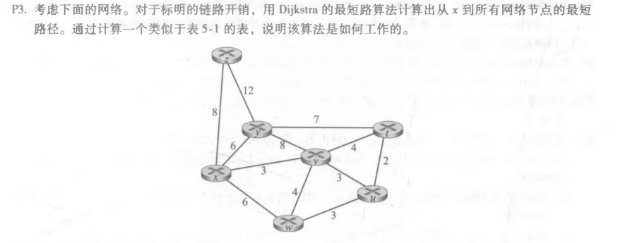
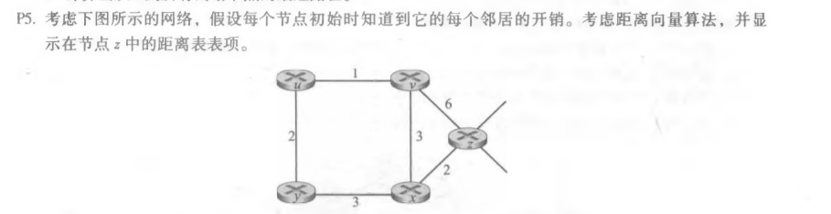

#### P3.

题目：

答：

|      |         | D(t),p(t) | D(u),p(u) | D(v),p(v) | D(w),p(w) | D(y),p(y) | D(z),p(z) |
| :--: | :-----: | :-------: | :-------: | :-------: | :-------: | :-------: | :-------: |
|  0   |    x    |    inf    |    inf    |    3,x    |    6,x    |    6,x    |    8,x    |
|  1   |   xv    |    7,v    |    6,v    |           |    6,x    |    6,x    |    8,x    |
|  2   |   xvu   |    7,v    |           |           |    6,x    |    6,x    |    8,x    |
|  3   |  xvuw   |    7,v    |           |           |           |    6,x    |    8,x    |
|  4   |  xvuwy  |    7,v    |           |           |           |           |    8,x    |
|  5   | xvuwyt  |           |           |           |           |           |    8,x    |
|  6   | xvuwytz |           |           |           |           |           |           |

#### P5.

题目：

答：

| From/To |  u   |  v   |  x   |  y   |  z   |
| :-----: | :--: | :--: | :--: | :--: | :--: |
|    x    | inf  | inf  | inf  | inf  | inf  |
|    v    | inf  | inf  | inf  | inf  | inf  |
|    z    | inf  |  6   |  2   | inf  |  0   |

| From/To |  u   |  v   |  x   |  y   |  z   |
| :-----: | :--: | :--: | :--: | :--: | :--: |
|    x    | inf  |  3   |  0   |  3   | inf  |
|    v    |  1   |  0   |  3   | inf  |  6   |
|    z    |  7   |  5   |  2   |  5   |  0   |

| From/To |  u   |  v   |  x   |  y   |  z   |
| :-----: | :--: | :--: | :--: | :--: | :--: |
|    x    |  4   |  3   |  0   |  3   |  2   |
|    v    |  1   |  0   |  3   |  3   |  5   |
|    z    |  6   |  5   |  2   |  5   |  0   |

| From/To |  u   |  v   |  x   |  y   |  z   |
| :-----: | :--: | :--: | :--: | :--: | :--: |
|    x    |  4   |  3   |  0   |  3   |  2   |
|    v    |  1   |  0   |  3   |  3   |  5   |
|    z    |  6   |  5   |  2   |  5   |  0   |

#### P9.

题目：

答：

不会出现无穷计数问题，因为降低链接开销不会导致循环。

将没有链路的节点连接起来，相当于将开销从无穷降到了有限值，所以也不会出现无穷计数问题。